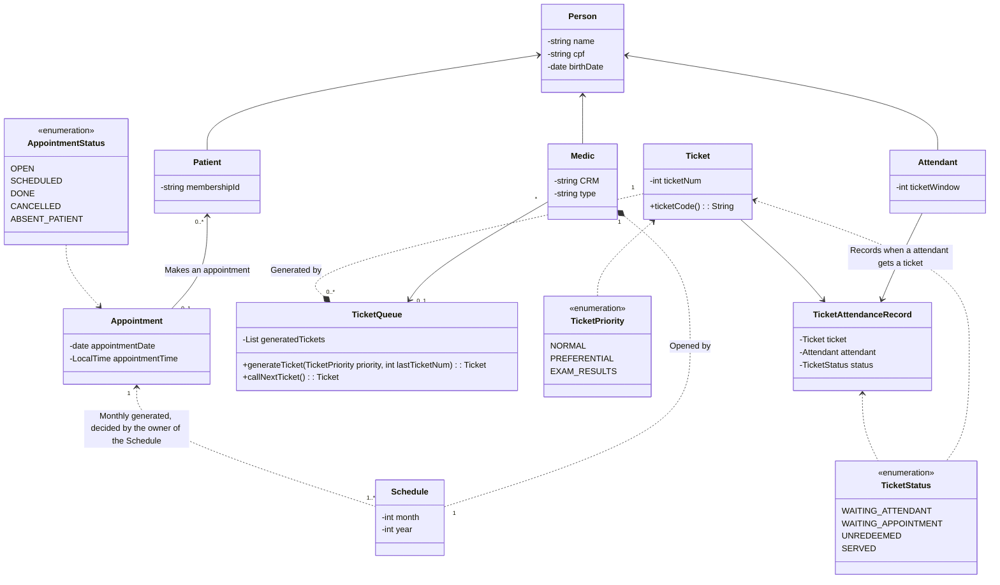

# 🏥OPENCLINIC

This is a project that I (João Oliveira) made for studying Spring Boot principles. 🚀
The goal is to make an system for a health care clinic that patients can schedule appointments based on schedule calendars of the medics, attendants can serve patients who have scheduled appointments beforehand or want to do that(if there are medics with open schedules), and medics can put their schedule for attending patients with the possibility to cancel an attend at any time. 

The following diagram shows the initial class model for the project.

This model can change, I will update it based on RFCs on the [docs](/docs) folder.
