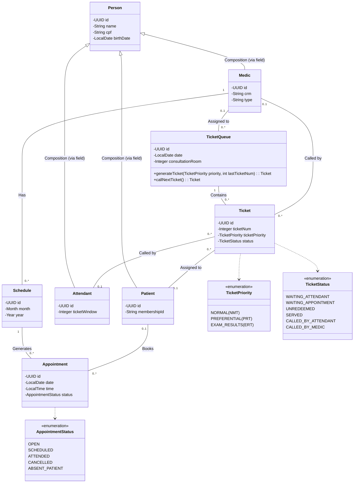

# 🏥 OPENCLINIC

## 📝 Context

This is a project developed by João Oliveira to study Spring Boot principles and modern backend architecture. 🚀

The goal is to create a comprehensive system for a healthcare clinic where:

- **Medics** can manage their monthly schedules, creating availability slots for appointments.
- **Patients** can self-schedule appointments based on medic availability.
- **Attendants** manage patient flow using ticket queues, serving both walk-in patients and those with scheduled
  appointments.
- **Ticket System** handles prioritization and routing of patients to the correct medic or attendant.
- **Appointments** are automatically generated based on medic schedules and can be managed (scheduled, cancelled,
  completed).

## 💻 Technologies

This section lists all the software, frameworks, and tools used in this project.

### 🏗️ Frameworks and Languages

- **Java 21**
- **Spring Boot 3.5.7**
- **Spring Data JPA**
- **Spring Web**
- **PostgreSQL 16.0** (Driver: `org.postgresql:postgresql`)
- **Lombok**
- **SpringDoc OpenAPI (Swagger UI)**

### 📦Containerization

- **Docker**
- **Portainer**

### 📚 Documentation and Planning

- **Obsidian**
- **Plane**
- **Mermaid.js** (for diagrams)

### 🚧 Building

- **Gradle**

### 🧪 Testing and REST Client

- **Bruno**
- **Swagger UI** (Built-in)

### 💻 IDE and Database Administration

- **IntelliJ IDEA Community Edition**
- **DataGrip** / **DBeaver**

## 📊 Design

The following diagram shows the current class model for the project.



## 🏃 How to Run

### Prerequisites

* **Java 21** installed.
* **PostgreSQL** installed and running.
* **Gradle** (optional, wrapper included).

### Environment Variables

You must set the following environment variables before running the application. You can set them in your IDE run
configuration or in your system environment.

| Variable | Description | Example |
| --- | --- | --- |
| `OPENCLINIC_DATASOURCE_URL`  | JDBC URL for your PostgreSQL database. | `jdbc:postgresql://localhost:5432/openclinic` |
| `OPENCLINIC_DATASOURCE_USERN AME` | Database username | `postgres` |
| `OPENCLINIC_DATASOURCE_PASSW ORD` | Database password | `password` |

### Running the Application

1. **Clone the repository:**
   ```bash
   git clone https://github.com/jovi-j/OpenClinic.git
   cd OpenClinic
   ```

2. **Build and Run using Gradle Wrapper:**
    * **Linux/macOS:**
      ```bash
      ./gradlew bootRun
      ```
    * **Windows:**
      ```bash
      gradlew.bat bootRun
      ```

3. **Access the Application:**
   The application will start on port `8182` (configured in `application.yaml`).
    * **API Base URL:** `http://localhost:8182`
    * **Swagger UI:** `http://localhost:8182/swagger-ui.html`

## 🚄 API Documentation

The API is fully documented using Swagger/OpenAPI. You can access the documentation at:
`http://localhost:8182/swagger-ui.html` (when the application is running).

### Key Features & Endpoints

* **Medics, Patients, Attendants:** CRUD operations via RESTful endpoints.
* **Schedules:** Medics create monthly schedules, which auto-generate appointment slots.
* **Appointments:**
    * Search by patient, medic, date, and status (with pagination).
    * Schedule and cancel appointments.
* **Tickets & Queues:**
    * Create ticket queues for the current date.
    * Generate tickets with priorities.
    * Call the next ticket (associates with Medic or Attendant).
    * Redirect tickets from generic queues to specific medic queues.
    * Complete tickets (marks appointment as attended).
