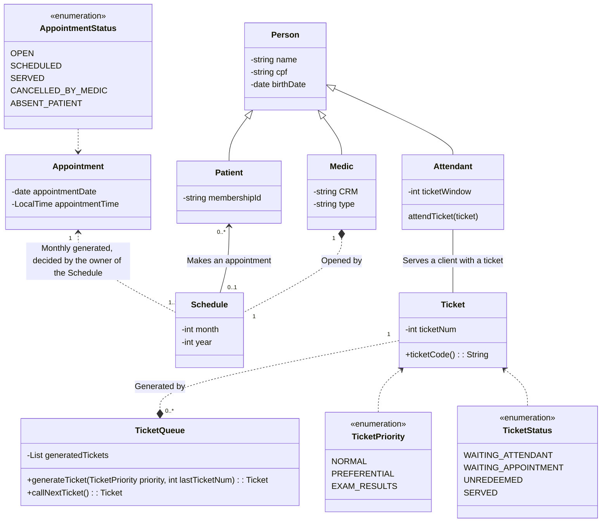
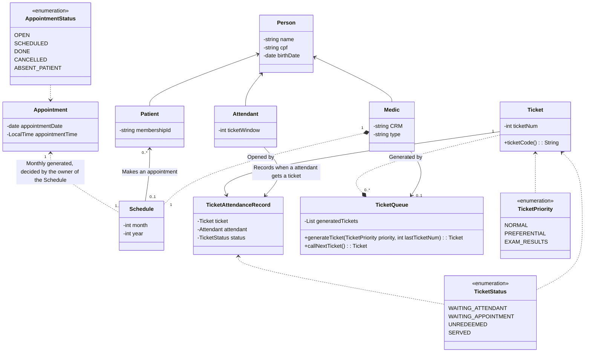

# RFC #001 - Initial Design of the OpenClinic
### Author: Jovi
### Status: TBD
### Reviewers: Gabriela
# Context
For studying purposes, I had an idea for a clinic management system that is capable of organizing the patients by priorities, and then dispatching them to their respective doctors. For now, I will only focus on the core functionalities, meaning that concepts like Authentication, Authorization, data race conditions, etc., will be addressed later on.

The goal is to be an MVP of a clinic management system that meets the following criteria:

- Schedule appointments for patients;
- Organize a queue to serve those who came to the clinic with their appointments previously scheduled and for those wanting to do that on-site;
- Call those patients in a queue, organized within certain priorities;
- Organize a monthly schedule for each medic, so the patients can see when their doctors are available;
- Permission for medics to cancel appointments;
- Permission for attendants to cancel and create schedules, change existing ones if a patient does not show up at the time, and prioritize tickets if a person meets the criteria(for now, consider "preferential" patients the ones over 60 years old);
- Keep a log of destructive operations like the change of patient in an appointment(in case a previous patient does not show up in time), lifetime of a ticket(from "waiting attendant" to "serving" status), Schedule opening/closing with timestamp, and Appointment begin and end with a timestamp(for medical certificate reduced hours).

This class diagram shows the basic version for the core functionalities.

(REVIEW 04/11/2025: GABRIELA) After some discussions about the queue logic and the relations between tickets and attendants, we agreed to some changes.

First, the ticket queue logic, because when the patient gets served by the attendant, they go to another queue(the medic's appointments queue), and keeping track of this without another queue entity will add an unnecessary amount of complexity. So, to ease things out, I will add an association from queue to medic, for sorting which queue is for ticket serving and which is for appointments.

Furthermore, the current relationship for the attendants and tickets does not hold information about when they change status, nor when they change queues, and this prevents loss of data tracking and adds the possibility of passing a ticket to another attendant(in future updates, not in the current scope).

This is the revisited diagram class:

